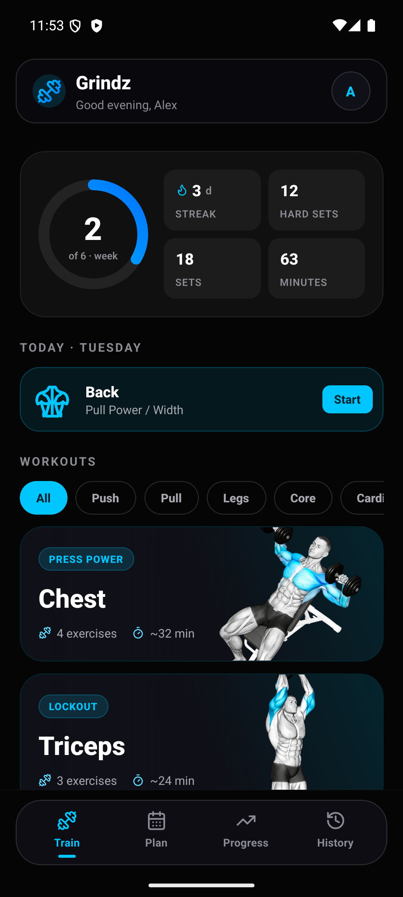
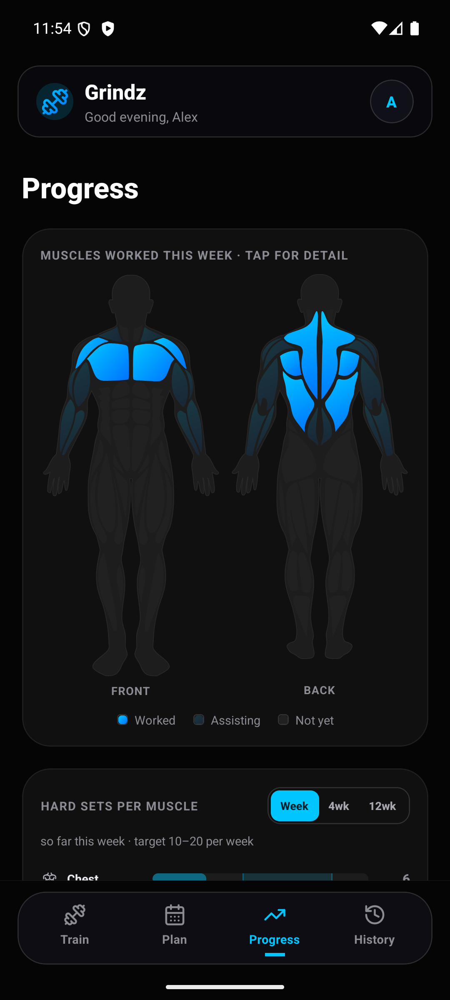
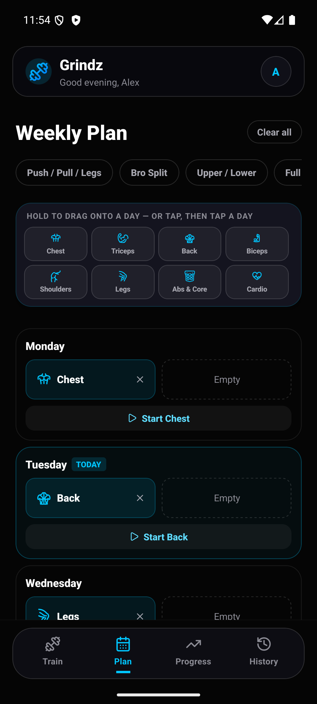
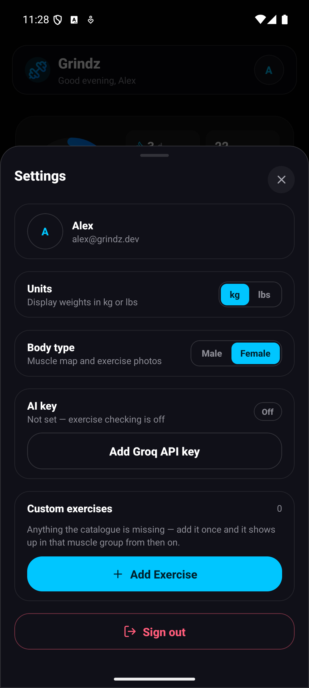
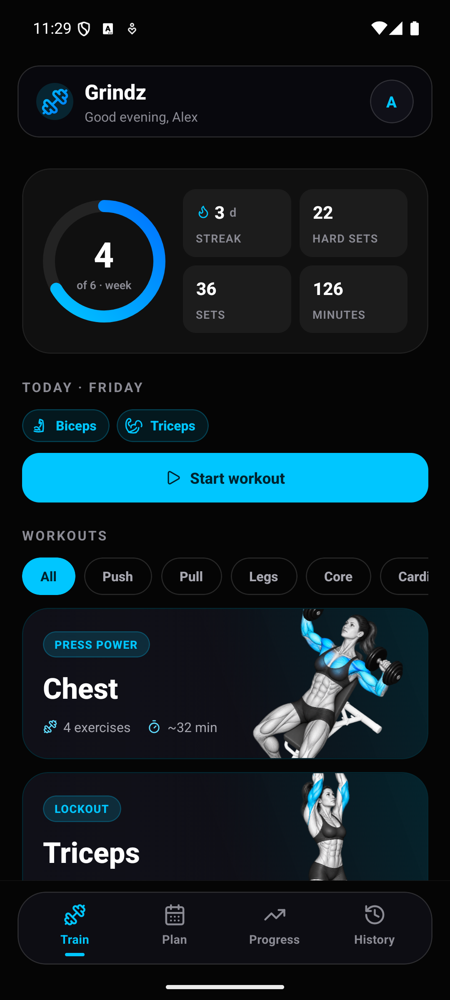
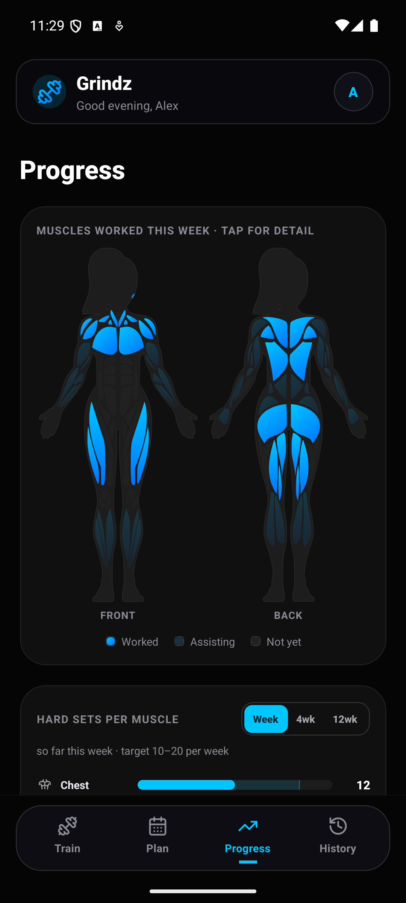
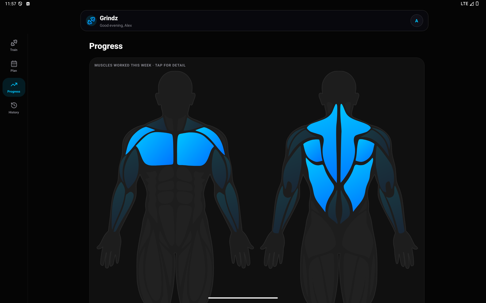

<div align="center">


# Grindz

**Log lifts. Chase PRs. See exactly what you've trained.**

A training tracker built twice — as a React Native Android app and as an installable web app —
sharing one Supabase backend, one muscle map palette, and one image CDN.

<br/>

[](../../releases/latest)
[](docs/INSTALL.md)
[](https://app.grindz.dev)


<br/>





<sub><b>Train</b> · today's plan and the week's numbers &nbsp;&nbsp;|&nbsp;&nbsp; <b>Progress</b> · what you actually hit this week &nbsp;&nbsp;|&nbsp;&nbsp; <b>Plan</b> · drag a split onto your week</sub>

</div>

---

## What it does

Grindz is a training log with a muscle map that shows exactly what you worked this week. Every muscle is shaded by what you actually trained so a group you keep skipping is impossible to miss.

🗺️ **MUSCLE MAP** - Traced vector figures with every muscle individually addressable. Shaded by what you actually hit this week.

🧍 **BODY TYPE** - Switch between a male and female muscle map and exercise photo set from Settings, on the phone or in the browser. The choice is saved to your account, not the device, so it's already right the next time you sign in anywhere — switch on your phone and the web app has already changed by the time you open it.

<div align="center">





<sub>One switch in Settings changes both the photo set and the muscle map, on Android and on the web</sub>

</div>

📅 **WEEKLY PLANNER** - Drag a split onto any day and it surfaces on the home screen ready to start. 35 exercises come with photos and form cues, and you can add your own exercise with Groq writing the cue if you want it.

📈 **PROGRESSION MEMORY** -  Last time and your best sit right where you are about to type. PRs get detected as they happen.

📝 **LIVE LOGGING** - Record kg × reps with RPE captured right after the set. Timed holds, supersets, notes and warm up flags are all handled. The rest timer starts itself and keeps the screen awake.

🏋️ **ACCURATE TRACKING** - One trip to the gym is one session. Chest and triceps is a single workout, not two. Every set remembers the muscle it actually trained, so the map stays exact even when the session wanders off the plan.

---

## On a tablet, and in the browser

Neither layout is a stretched phone. At Material 3's `expanded` breakpoint the bottom tab bar
becomes a side rail and card grids widen to three or four columns. The web app is rebuilt
around what a browser actually has: a cursor, a keyboard and a viewport wider than it is tall.
`⌘K` opens a command palette that reaches every section, muscle group and exercise.

<div align="center">

</div>

---

## Getting it on your phone

<div align="center">

<a href="../../releases/latest"></a>

</div>

Android will ask you to allow installs from your browser the first time. Play Protect will warn
you because the app did not come from the Play Store, so tap **Install without scanning** and
carry on.

→ **[Full install guide](docs/INSTALL.md)** with screenshots, plus updating and `adb install`.

Prefer nothing to install? The web app is the same product. Open
**[app.grindz.dev](https://app.grindz.dev)** and add it to your home screen.

---

## Tech stack

<table>
<tr>
<td width="30%"><br/></td>
<td>Ships the Android APK, on the new architecture. Built ARM only, which halved the download.</td>
</tr>
<tr>
<td><br/> </td>
<td>The installable web app at <code>app.grindz.dev</code>, and the marketing site at <code>grindz.dev</code> as a separate 70 KB deployment.</td>
</tr>
<tr>
<td></td>
<td>Everywhere, strict. The muscle geometry and PR maths are shared as typed source rather than duplicated by hand.</td>
</tr>
<tr>
<td></td>
<td>Postgres for every set and session, Google OAuth for sign in, and Storage for photos you upload.</td>
</tr>
<tr>
<td></td>
<td>Serves the 35 exercise photos, in both a male and a female set. Neither app bundles them, so a device downloads a given photo at most once in its lifetime instead of paying 33 MB on every update.</td>
</tr>
<tr>
<td></td>
<td>Hosts both web deployments, one per origin. See <a href="docs/DOMAINS.md">docs/DOMAINS.md</a>.</td>
</tr>
</table>

---

## How it's built

```
grindz/
├── apps/
│   ├── landing/       The pitch → grindz.dev. No auth, no router, 70 KB gzip
│   ├── web/           React 18 + Vite + Tailwind, installable PWA → app.grindz.dev
│   └── mobile/        React Native 0.86 · Expo SDK 57  ← ships the APK
├── cdn/               Cloudflare image delivery — the 35 exercise photos
├── docs/              Install, build, architecture, domains, screenshots
├── supabase/          migrations/0001_init.sql — the whole schema
└── scripts/           check-parity · check-cdn · check-domains
```

→ **[Build guide](docs/BUILD.md)** · **[Architecture](docs/ARCHITECTURE.md)** ·
**[Domains](docs/DOMAINS.md)** · **[Supabase setup](docs/SUPABASE-SETUP.md)** ·
**[Images & CDN](docs/IMAGES.md)** · **[Catalog sync](docs/CATALOG.md)**

---

<div align="center">
<sub>Built for one lifter who wanted the log to be honest about what he'd actually trained.</sub>
</div>
