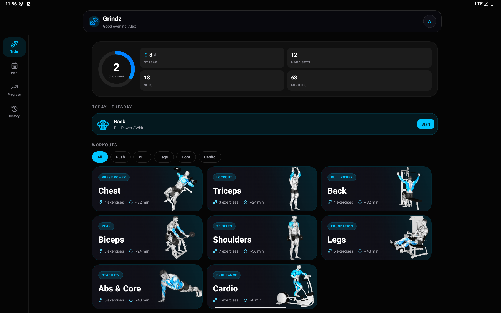
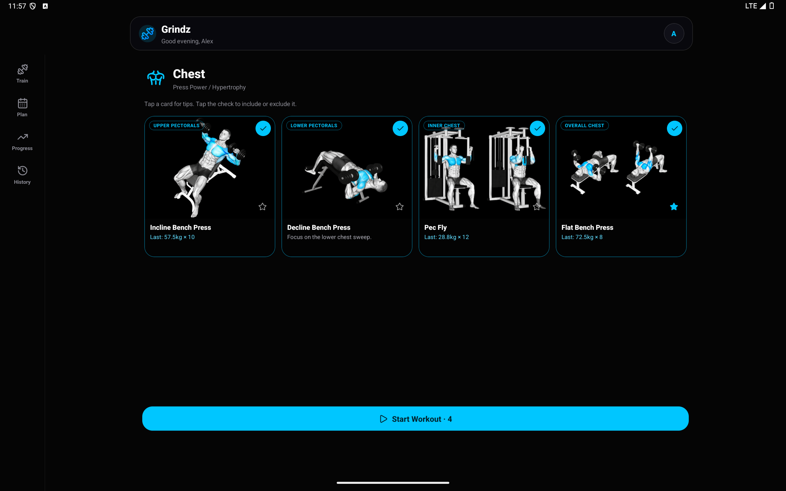
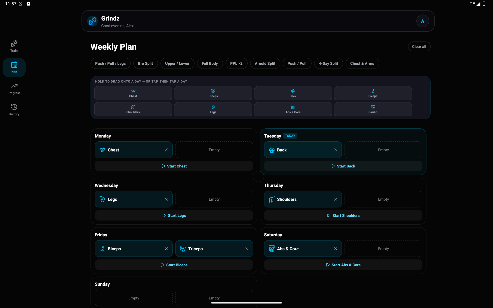
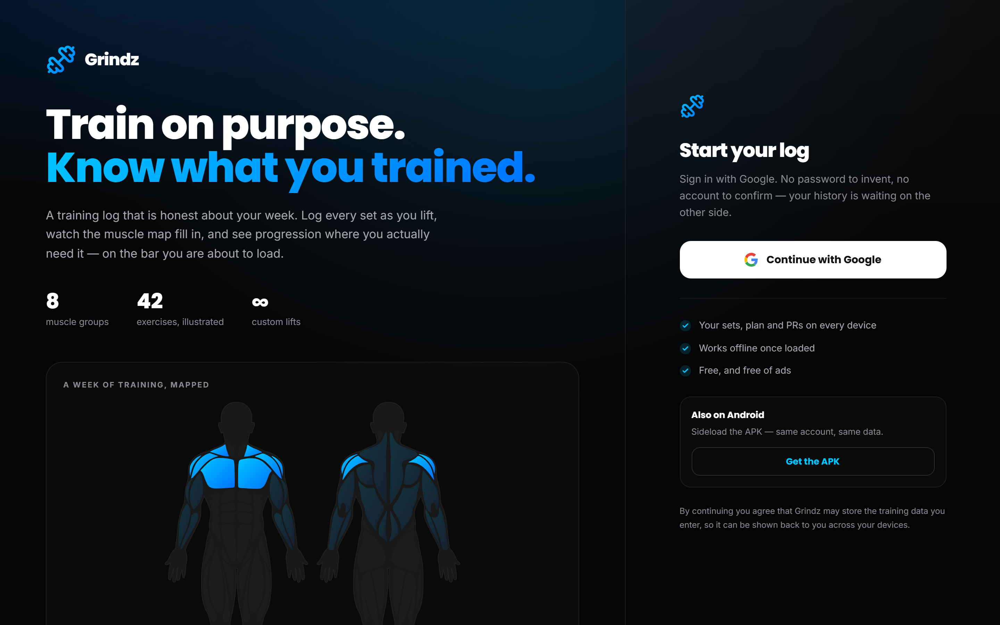
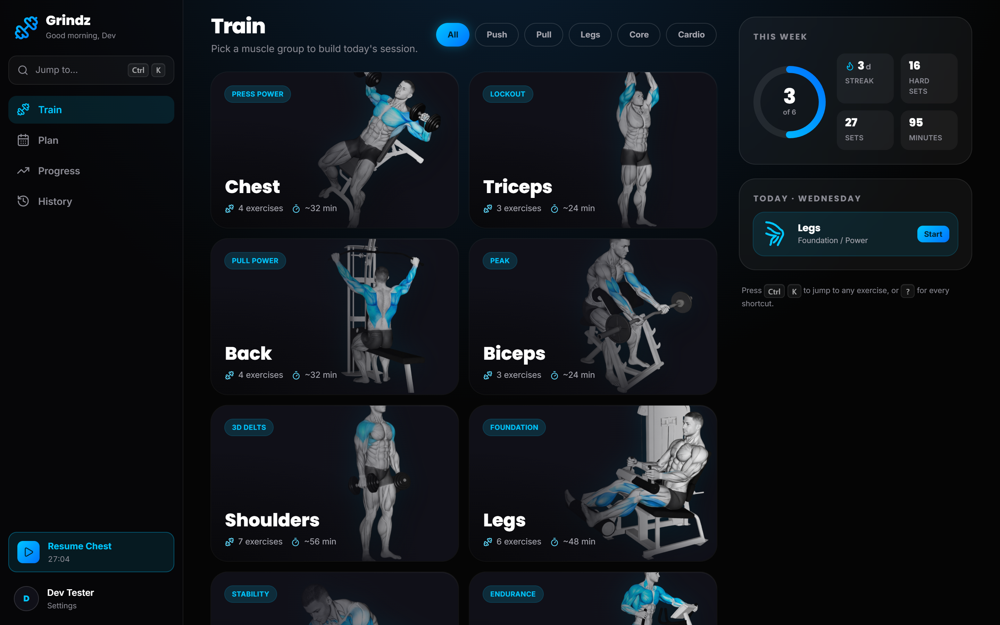
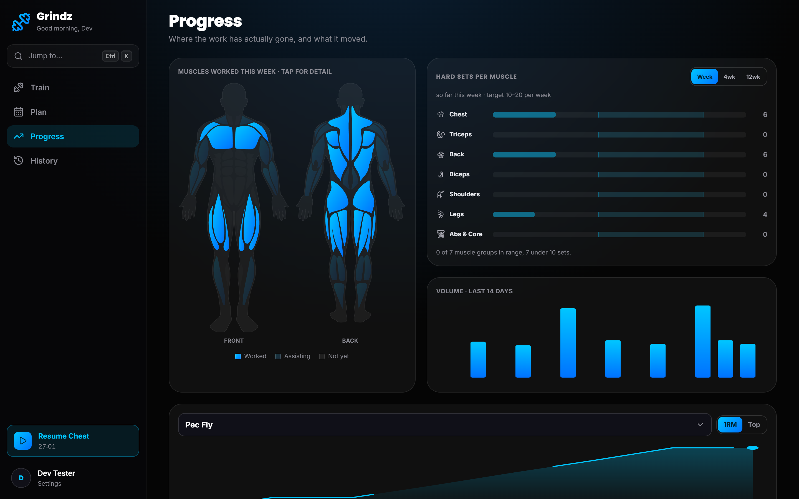
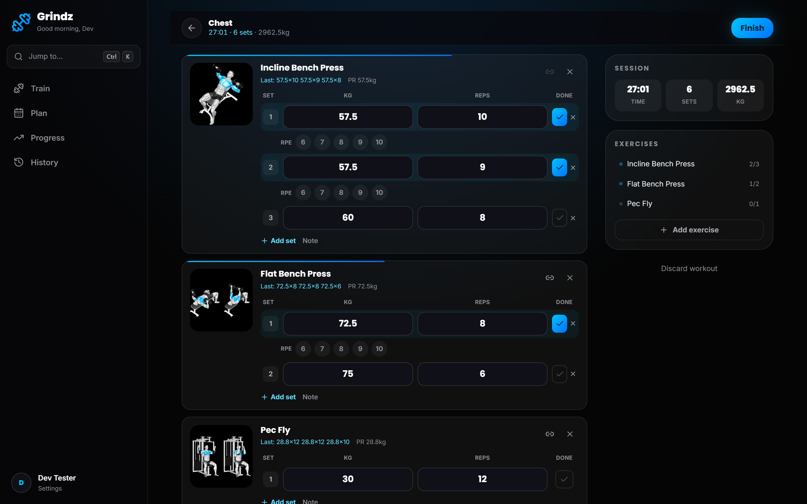
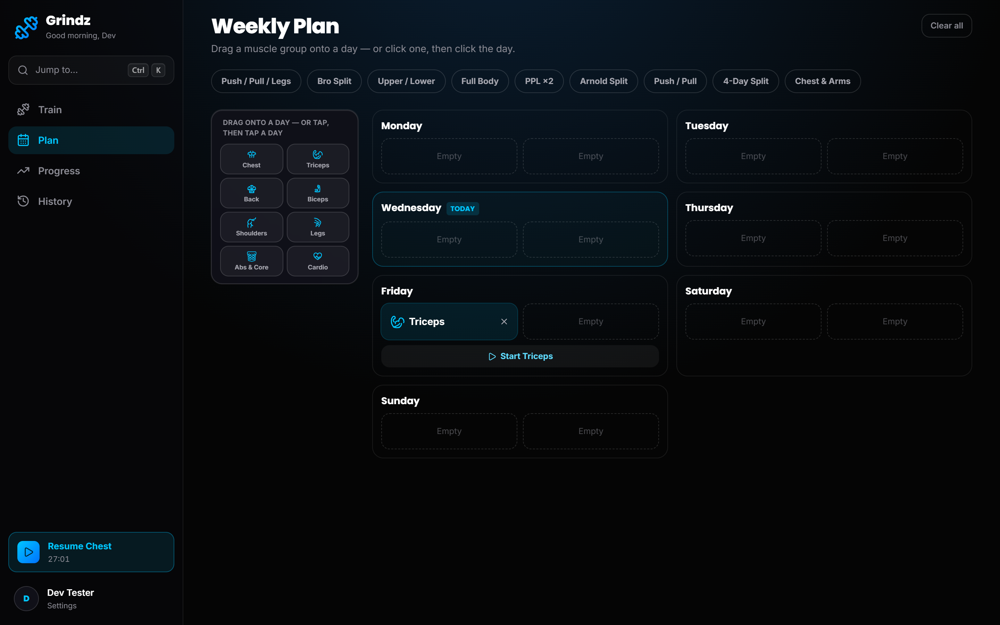

<div align="center">


# Grindz

**Log lifts. Chase PRs. See exactly what you've trained.**

A training tracker built twice — as a React Native Android app and as an installable web app —
sharing one Supabase backend, one muscle-map palette, and one image CDN.

<br/>

[](../../releases/latest)
[](docs/INSTALL.md)


</div>

---

<div align="center">


<sub><b>Train</b> · pick a muscle group &nbsp;&nbsp;|&nbsp;&nbsp; <b>Progress</b> · what you actually hit this week &nbsp;&nbsp;|&nbsp;&nbsp; <b>Session</b> · log sets, RPE and rest</sub>

<br/><br/>


<sub><b>Exercises</b> · photos stream from the CDN &nbsp;&nbsp;|&nbsp;&nbsp; <b>History</b> · 16-week heatmap and streak &nbsp;&nbsp;|&nbsp;&nbsp; <b>Plan</b> · drag a split onto your week</sub>

</div>

---

## What it does

**Live workout logging.** Sets as kg × reps, ticked off as you go, with a running session
timer. RPE is captured on the set you just finished, so you rate it while it's still honest.
Also handles timed holds and distance work, supersets, per-set notes and warm-up flags.

**Progression memory.** Every exercise shows what you did *last time* and your best, right
where you're about to type. PRs — both top set and estimated 1RM — are detected as they happen.

**A muscle heat map that means something.** Not decoration: the front/back figures are traced
vector geometry with each muscle individually addressable, shaded by what you've actually
trained this week. Bright for worked, a deliberately faint wash for assisting, flat for
untouched.

**Planning and review.** A weekly plan you can drag a split onto, a 16-week training heatmap,
a streak counter, 14-day volume, per-exercise progression charts, a 30-day muscle split, and
bodyweight trend.

**An auto rest timer** that starts on each completed set, with +15s, skip, and a vibration
when it's up — plus a wake lock so the screen doesn't die mid-set.

**Optional AI assist.** Adding a custom exercise? Groq validates the name, files it under the
right muscle group and writes a form cue, using *your own* API key. Advisory only — you can
always just save what you typed.

---

## On a tablet

The layout isn't a stretched phone. At Material 3's `expanded` breakpoint the bottom tab bar
becomes a side rail, card grids widen to three or four columns, and the reading column is
capped so text never runs the full 1700dp.

<div align="center">

<br/><br/>

</div>

<div align="center">


</div>

---

## In the browser

The web app is **not the phone layout stretched wide**. It is rebuilt around what a browser
actually has: a cursor, a keyboard, and a viewport wider than it is tall.

A signed-out visitor gets a landing page built as three acts down a scrolling left column —
**the hook** (what this is, plus a live muscle map as the hero), **the proof** (screenshots and
the three features that carry the product), and **the close** (one account, and what happens to
your data). The right pane is sticky, so sign-in and the APK link stay on screen for the whole
scroll: the left side can be as long as it needs to be to earn the click, and the click is never
more than a glance away.

<div align="center">

</div>

Signed in, the bottom tab bar becomes a persistent left rail, and every screen is laid out for
the width:

<div align="center">




</div>

- **Train** — category grid beside a rail holding the week's numbers and today's plan.
- **Progress** — a twelve-column dashboard. The body map is deliberately *bounded*: given the
  whole viewport it scales to ~1400px and pushes every chart below the fold.
- **Session** — logging forms stay a readable measure, with a sticky rail carrying running
  totals and a jump list showing sets done per exercise.
- **Plan** — the week as columns with a palette rail, drag-and-drop intact.
- **History** — heatmap, search and filters pinned in a rail while the list scrolls.

**Keyboard is a real input.** `⌘K` / `Ctrl K` opens a command palette that reaches every
section, muscle group and exercise; `1`–`4` switch sections; `N` jumps to the active workout;
`?` lists the lot. All suppressed while typing, so logging a set never triggers navigation.

Deploys to **Vercel** — set the root directory to `apps/web` and add the two Supabase
variables. See **[docs/DEPLOY.md](docs/DEPLOY.md)**.

The landing page and the app are split across two hostnames, `grindz.dev` and
`app.grindz.dev`, served by **one** Vercel project that branches on the hostname at runtime.
See **[docs/DOMAINS.md](docs/DOMAINS.md)**.

---

## Images are served over Cloudflare

Every exercise photo and category hero comes from a **Cloudflare Workers static-assets
deployment** — they are not bundled into the apps.

```
https://cdn.grindz.dev/images/<category>/<file>.png
https://cdn.grindz.dev/hero/<category>.png
```

The 42 photos are about **33 MB**. They used to be compiled into the APK *and* the web build,
so every user paid that on first install **and on every update**, forever, whether or not they
ever opened a single exercise. Now a device downloads any given photo **at most once in its
lifetime**.

What makes that stick across an app update isn't the HTTP header — it's that caching is
explicit on both surfaces:

| Layer | Mechanism |
|---|---|
| CDN | `Cache-Control: public, max-age=31536000, immutable` |
| Web / PWA | Workbox `CacheFirst`, matched on the CDN **origin** |
| React Native | `expo-image` with `cachePolicy="memory-disk"` |

Cache Storage and the expo-image disk cache are keyed by URL and live in app storage, so they
survive updates. An HTTP cache alone wouldn't reliably do that.

The URL contract lives in exactly one file, kept byte-identical in both apps and enforced by
`scripts/check-parity.mjs`. Filenames are effectively content-addressed — a changed photo ships
under a **new** name, never overwritten in place, because devices hold the old copy for a year.

The trade-off, stated plainly: the first time you open a muscle group you want a connection.
After that the photos are on disk.

→ **[Full CDN notes](cdn/README.md)**

---

## Getting it on your phone

Grab the APK from the **[latest release](../../releases/latest)** and install it — Android will
ask you to allow installs from your browser the first time.

**Yes, the APK is on GitHub** — attached to a *Release*, not committed into the repo. That's
deliberate: release assets don't bloat every clone the way a 55 MB binary in git history would,
they're versioned alongside a changelog, and the download link stays stable.

→ **[Step-by-step install guide](docs/INSTALL.md)** — including sideloading warnings, updating,
and `adb install`

Prefer nothing to install? The web app is the same product — open it and **Add to Home Screen**.

---

## How it's built

```
grindz/
├── apps/
│   ├── web/           React 18 + TypeScript + Vite + Tailwind, installable PWA → Vercel
│   └── mobile/        React Native 0.86 · Expo SDK 57 · new architecture  ← ships the APK
├── cdn/               Cloudflare image delivery — the 42 PNGs, headers, wrangler config
├── docs/              Install, build, architecture, screenshots
└── scripts/           check-parity.mjs
```

Two stacks, deliberately **not** a shared component library — a Tailwind `<div>` and a React
Native `<View>` don't usefully unify, and forcing it yields a lowest-common-denominator UI on
both. What *is* shared is everything where disagreement would be a bug: the CDN contract, the
heat-map palette, the traced muscle geometry, the exercise→muscle mapping, and the PR/volume
maths. Five files, byte-identical, enforced:

```bash
node scripts/check-parity.mjs
```

→ **[Architecture](docs/ARCHITECTURE.md)** · **[Build guide](docs/BUILD.md)** ·
**[Domains](docs/DOMAINS.md)** · **[Supabase setup](docs/SUPABASE-SETUP.md)** ·
**[Images & CDN](docs/IMAGES.md)** · **[Deploying](docs/DEPLOY.md)**

---

## Running it

```bash
# web
cd apps/web && npm install && npm run dev

# with demo data, no Google sign-in needed
VITE_DEV_BYPASS_AUTH=1 VITE_DEV_SEED=1 npm run dev

# android
cd apps/mobile && npm install && npm run android
```

Both apps need a `.env` pointing at a Supabase project — see **[docs/BUILD.md](docs/BUILD.md)**.
Neither `.env` nor any signing keystore is in this repo.

---

<div align="center">
<sub>Built for one lifter who wanted the log to be honest about what he'd actually trained.</sub>
</div>
