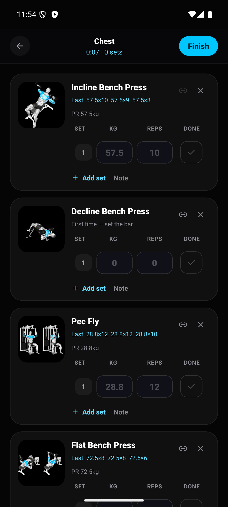
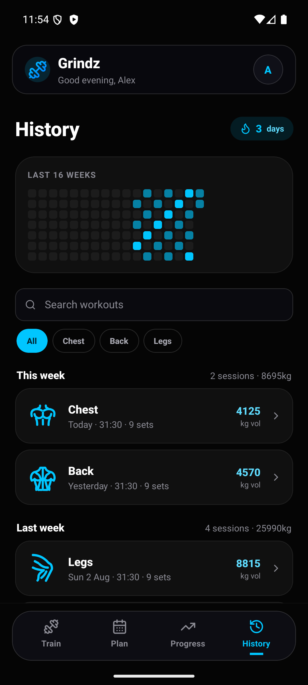
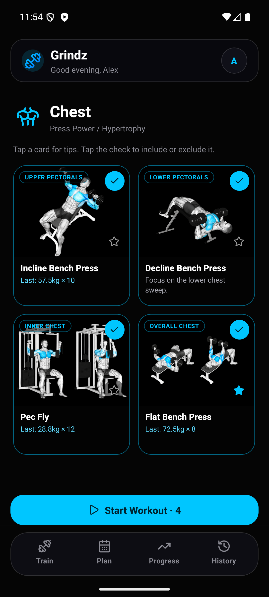

<div align="center">


# Grindz

**Log lifts. Chase PRs. See exactly what you've trained.**

A training tracker built twice — as a React Native Android app and as an installable web app —
sharing one Supabase backend, one muscle-map palette, and one image CDN.

<br/>

[](../../releases/latest)
[](docs/INSTALL.md)
[](https://app.grindz.dev)


</div>

---

## What it does

<table>
<tr>
<td width="27%"></td>
<td>

**A muscle heat map that means something.** Not decoration: the front and back figures are
traced vector geometry with each muscle individually addressable, shaded by what you've
actually trained this week. Bright for worked, a deliberately faint wash for assisting, flat
for untouched. It is the fastest way to spot the group you keep skipping.

</td>
</tr>
<tr>
<td width="27%"></td>
<td>

**Live workout logging.** Sets as kg × reps, ticked off as you go, with RPE captured on the set
you just finished — so you rate it while it's still honest. Timed holds, supersets, per-set
notes and warm-up flags are all handled. The rest timer starts itself and holds a wake lock, so
the screen doesn't die mid-set.

</td>
</tr>
<tr>
<td width="27%"></td>
<td>

**One session, however many muscle groups.** A day planned as chest and triceps is one trip to
the gym, not two workouts. Today's groups appear as chips under a single **Start workout**
button. Every set still carries the muscle it actually trained, so the heat map and the
per-group counts stay exact no matter how far the session wanders off the plan.

</td>
</tr>
<tr>
<td width="27%"></td>
<td>

**Plan the week.** Drag a split onto any day, up to three blocks, and today's plan surfaces on
the home screen with a Start button already on it. A day only advertises a landing space while
you're actually carrying a block.

</td>
</tr>
<tr>
<td width="27%"></td>
<td>

**Progression memory.** Every exercise shows what you did *last time* and your best, right
where you're about to type. PRs — both top set and estimated 1RM — are detected as they happen.
History keeps a 16-week heatmap, a streak counter and every session you've logged, searchable.

</td>
</tr>
<tr>
<td width="27%"></td>
<td>

**42 exercises, illustrated.** Each one carries a photo, the muscles it works and a form cue.
Add your own and, if you want it, Groq files the new exercise under the right muscle group and
writes the cue for you — using *your own* API key, advisory only.

</td>
</tr>
</table>

---

## On a tablet, and in the browser

Neither layout is a stretched phone. At Material 3's `expanded` breakpoint the bottom tab bar
becomes a side rail and card grids widen to three or four columns. The web app is rebuilt
around what a browser actually has: a cursor, a keyboard and a viewport wider than it is tall.
`⌘K` opens a command palette that reaches every section, muscle group and exercise.

<div align="center">

</div>

---

## Getting it on your phone

Grab the APK from the **[latest release](../../releases/latest)** and install it. Android will
ask you to allow installs from your browser the first time, and Play Protect will warn you
because the app didn't come from the Play Store — tap **Install without scanning** and carry on.

→ **[Step-by-step install guide](docs/INSTALL.md)**, including updating and `adb install`.

Prefer nothing to install? The web app is the same product — open
**[app.grindz.dev](https://app.grindz.dev)** and add it to your home screen.

**Yes, the APK is on GitHub** — attached to a *Release*, not committed into the repo. A 52 MB
binary in git history is a tax every clone pays forever.

---

## Tech stack

<table>
<tr>
<td width="30%"><br/></td>
<td>Ships the Android APK, on the new architecture. Built ARM-only, which halved the download.</td>
</tr>
<tr>
<td><br/> </td>
<td>The installable web app at <code>app.grindz.dev</code>, and the marketing site at <code>grindz.dev</code> as a separate 70 KB deployment.</td>
</tr>
<tr>
<td></td>
<td>Everywhere, strict. The muscle geometry and PR maths are shared as typed source rather than duplicated by hand.</td>
</tr>
<tr>
<td></td>
<td>Postgres for every set and session, row-level security so a row is only ever yours, Google OAuth for sign-in, and Storage for photos you upload.</td>
</tr>
<tr>
<td></td>
<td>Serves the 42 exercise photos. Neither app bundles them, so a device downloads a given photo at most once in its lifetime instead of paying 33 MB on every update.</td>
</tr>
<tr>
<td></td>
<td>Hosts both web deployments, one per origin. See <a href="docs/DOMAINS.md">docs/DOMAINS.md</a>.</td>
</tr>
</table>

---

## How it's built

```
grindz/
├── apps/
│   ├── landing/       The pitch → grindz.dev. No auth, no router, 70 KB gzip
│   ├── web/           React 18 + Vite + Tailwind, installable PWA → app.grindz.dev
│   └── mobile/        React Native 0.86 · Expo SDK 57  ← ships the APK
├── cdn/               Cloudflare image delivery — the 42 exercise photos
├── docs/              Install, build, architecture, domains, screenshots
├── supabase/          migrations/0001_init.sql — the whole schema
└── scripts/           check-parity · check-cdn · check-domains
```

Two stacks, deliberately **not** a shared component library — a Tailwind `<div>` and a React
Native `<View>` don't usefully unify. What *is* shared is everything where disagreement would
be a bug: the CDN contract, the heat-map palette, the traced muscle geometry and the PR maths.
Five files, byte-identical, enforced by `node scripts/check-parity.mjs`.

→ **[Build guide](docs/BUILD.md)** · **[Architecture](docs/ARCHITECTURE.md)** ·
**[Domains](docs/DOMAINS.md)** · **[Supabase setup](docs/SUPABASE-SETUP.md)** ·
**[Images & CDN](docs/IMAGES.md)**

---

<div align="center">
<sub>Built for one lifter who wanted the log to be honest about what he'd actually trained.</sub>
</div>
